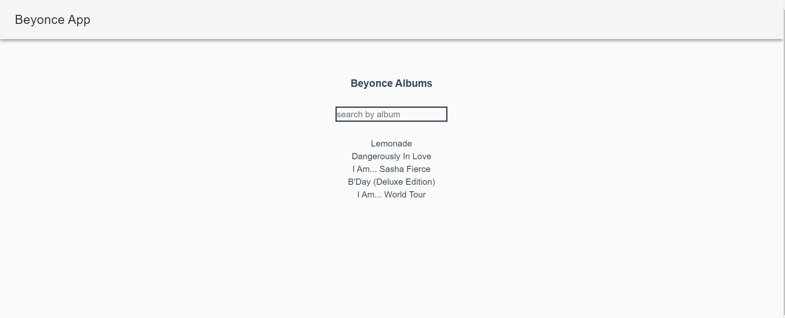

# beyonce-app

This is a small Vue app to display beyonce's albums, I created this app in an attempt to learn Vue. You can filter albums by CollectionName(album name). The library used are axios and vuetify.
The react version of this app can be found at [Beyonce-app](https://github.com/AKFessha/beyonce-app/tree/solution) repo


## Project setup

```
npm install
```

### Compiles and hot-reloads for development

```
npm run serve
```

### Compiles and minifies for production

```
npm run build
```

### Run your tests

```
npm run test
```

### Lints and fixes files

```
npm run lint
```
